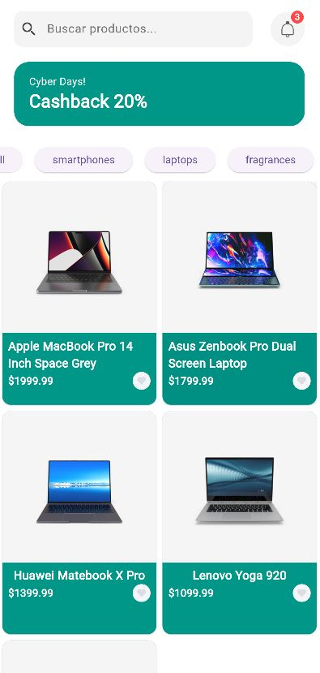
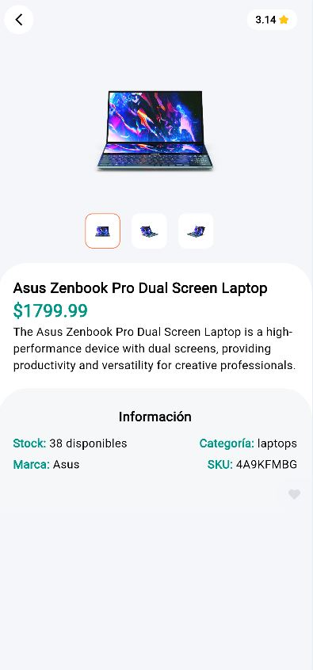

# 🛍️ Flutter - App Productos

**Flutter App Productos** es una aplicación móvil desarrollada en **Flutter** que consume la API pública de [DummyJSON](https://dummyjson.com/). Permite ver una lista de productos con **scroll infinito**, visualizar el detalle de cada producto y gestionar el estado con **Riverpod**.

---

## 🚀 Funcionalidades

✔️ Listado de productos desde API pública [DummyJSON].  
✔️ Scroll infinito para cargar más productos.  
✔️ Pantalla de detalle con descripción e imagen.  
✔️ Gestión de estado con **Riverpod**.  
✔️ Navegación entre pantallas.  
✔️ Diseño **responsivo**.  

---

## 📸 Capturas de pantalla

| 📱 Lista de productos | 📱 Detalle del producto |
|----------------------|----------------------|
|  |  |

---

## ⚡ Instalación

### 1️ Clona este repositorio

```bash
git clone https://github.com/stivent00/flutter_dummy.git
cd flutter_dummy
```

### 2️⃣ Instala las dependencias

```bash
flutter pub get
```

### 3️⃣ Ejecuta la aplicación

```bash
flutter run
```

### 🛠️ Tecnologías utilizadas

✔️ Flutter 3.29.2  
✔️ Dart 3.7.2  
✔️ Riverpod (gestión de estado)  
✔️ DummyJSON API (fuente de datos)  


### 📄 Licencia  

Este proyecto está bajo la licencia MIT.


### 📫 Contacto

📧 Email: dspr124@gmail.com  
🔗 LinkedIn: [Daniel Perez](https://www.linkedin.com/in/danielperezroa/)